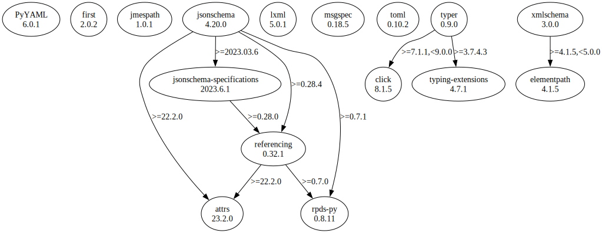

# Third Party Dependencies

<!--[[[fill sbom_sha256()]]]-->
The [SBOM in CycloneDX v1.4 JSON format](https://git.sr.ht/~sthagen/booq/blob/default/sbom/cdx.json) with SHA256 checksum ([daf5ca81 ...](https://git.sr.ht/~sthagen/booq/blob/default/sbom/cdx.json.sha256 "sha256:daf5ca8123b7fc179cb23f43ef3c0287fb8f64f2aef648c96be1619ffaaed01c")).
<!--[[[end]]] (checksum: a973de1bfce7a8dfcc40b3c44b18f4b8)-->
## Licenses 

JSON files with complete license info of: [direct dependencies](direct-dependency-licenses.json) | [all dependencies](all-dependency-licenses.json)

### Direct Dependencies

<!--[[[fill direct_dependencies_table()]]]-->
| Name                                                          | Version                                               | License     | Author             | Description (from packaging data)                                                                        |
|:--------------------------------------------------------------|:------------------------------------------------------|:------------|:-------------------|:---------------------------------------------------------------------------------------------------------|
| [PyYAML](https://pyyaml.org/)                                 | [6.0](https://pypi.org/project/PyYAML/6.0/)           | MIT License | Kirill Simonov     | YAML parser and emitter for Python                                                                       |
| [first](http://github.com/hynek/first/)                       | [2.0.2](https://pypi.org/project/first/2.0.2/)        | MIT License | Hynek Schlawack    | Return the first true value of an iterable.                                                              |
| [jmespath](https://github.com/jmespath/jmespath.py)           | [1.0.1](https://pypi.org/project/jmespath/1.0.1/)     | MIT License | James Saryerwinnie | JSON Matching Expressions                                                                                |
| [jsonschema](https://github.com/python-jsonschema/jsonschema) | [4.17.3](https://pypi.org/project/jsonschema/4.17.3/) | MIT License | Julian Berman      | An implementation of JSON Schema validation for Python                                                   |
| [lxml](https://lxml.de/)                                      | [4.9.2](https://pypi.org/project/lxml/4.9.2/)         | BSD License | lxml dev team      | Powerful and Pythonic XML processing library combining libxml2/libxslt with the ElementTree API.         |
| [msgspec](https://jcristharif.com/msgspec/)                   | [0.16.0](https://pypi.org/project/msgspec/0.16.0/)    | BSD License | Jim Crist-Harif    | A fast serialization and validation library, with builtin support for JSON, MessagePack, YAML, and TOML. |
| [toml](https://github.com/uiri/toml)                          | [0.10.2](https://pypi.org/project/toml/0.10.2/)       | MIT License | William Pearson    | Python Library for Tom's Obvious, Minimal Language                                                       |
| [typer](https://github.com/tiangolo/typer)                    | [0.9.0](https://pypi.org/project/typer/0.9.0/)        | MIT License | Sebastián Ramírez  | Typer, build great CLIs. Easy to code. Based on Python type hints.                                       |
| [xmlschema](https://github.com/sissaschool/xmlschema)         | [2.3.1](https://pypi.org/project/xmlschema/2.3.1/)    | MIT License | Davide Brunato     | An XML Schema validator and decoder                                                                      |
<!--[[[end]]] (checksum: 418bcb96a1256f7fe12e10f32439f711)-->

### Indirect Dependencies

<!--[[[fill indirect_dependencies_table()]]]-->
| Name                                                      | Version                                               | License     | Author                     | Description (from packaging data)                                    |
|:----------------------------------------------------------|:------------------------------------------------------|:------------|:---------------------------|:---------------------------------------------------------------------|
| [attrs](https://www.attrs.org/en/stable/changelog.html)   | [23.1.0](https://pypi.org/project/attrs/23.1.0/)      | MIT License | Hynek Schlawack <hs@ox.cx> | Classes Without Boilerplate                                          |
| [click](https://palletsprojects.com/p/click/)             | [8.1.3](https://pypi.org/project/click/8.1.3/)        | BSD License | Armin Ronacher             | Composable command line interface toolkit                            |
| [elementpath](https://github.com/sissaschool/elementpath) | [4.1.2](https://pypi.org/project/elementpath/4.1.2/)  | MIT License | Davide Brunato             | XPath 1.0/2.0/3.0/3.1 parsers and selectors for ElementTree and lxml |
| [pyrsistent](https://github.com/tobgu/pyrsistent/)        | [0.19.2](https://pypi.org/project/pyrsistent/0.19.2/) | MIT License | Tobias Gustafsson          | Persistent/Functional/Immutable data structures                      |
<!--[[[end]]] (checksum: 0ce8e2b47c1c98c431e1ae2334f6cb04)-->

## Dependency Tree(s)

JSON file with the complete package dependency tree info of: [the full dependency tree](package-dependency-tree.json)

### Rendered SVG

Base graphviz file in dot format: [Trees of the direct dependencies](package-dependency-tree.dot.txt)



### Console Representation

<!--[[[fill dependency_tree_console_text()]]]-->
````console
first==2.0.2
jmespath==1.0.1
jsonschema==4.17.3
├── attrs [required: >=17.4.0, installed: 23.1.0]
└── pyrsistent [required: >=0.14.0,!=0.17.2,!=0.17.1,!=0.17.0, installed: 0.19.2]
lxml==4.9.2
msgspec==0.16.0
PyYAML==6.0
toml==0.10.2
typer==0.9.0
├── click [required: >=7.1.1,<9.0.0, installed: 8.1.3]
└── typing-extensions [required: >=3.7.4.3, installed: 4.4.0]
xmlschema==2.3.1
└── elementpath [required: >=4.1.2,<5.0.0, installed: 4.1.2]
````
<!--[[[end]]] (checksum: 41d3b5dfdfad5e641801ddba746da07b)-->
